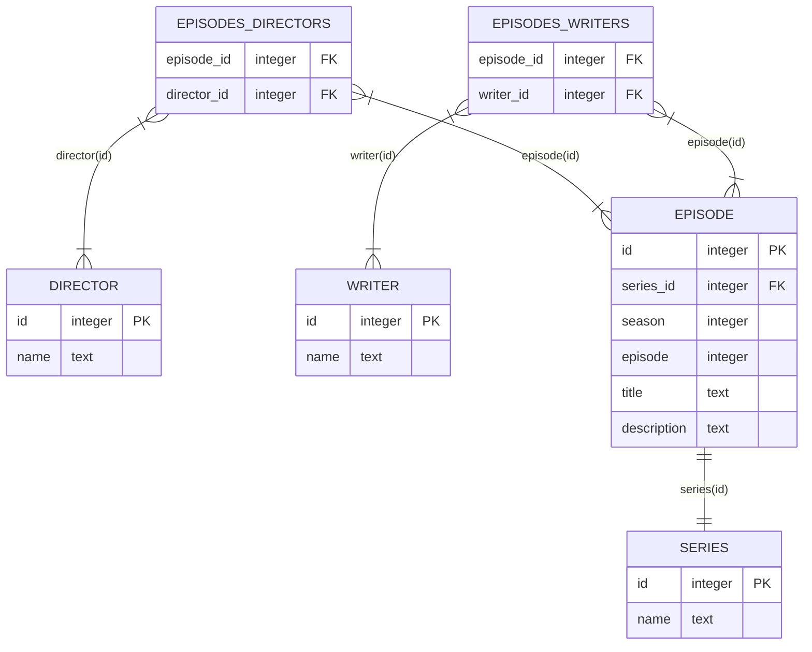

# Start Trek DB

PostgreSQL database cataloging the episodes from the "Star Trek" science fiction
television franchise.

Data can be seeded with the CSV files in `./src`.

Recent as of June 20, 2026.

## Table Schema

### series

| field | datatype | constraints      |
| ----- | -------- | ---------------- |
| id    | integer  | primary key      |
| name  | text     | unique, not null |

### episode

| field        | datatype            | constraints                 |
| ------------ | ------------------- | --------------------------- |
| id           | integer             | primary key, auto increment |
| series_id    | integer             | not null, foreign key       |
| season       | integer             | not null                    |
| episode      | integer             | not null                    |
| title        | text                | not null                    |
| release_date | date ('YYYY-MM-DD') | not null                    |
| description  | text                | not null                    |

### director

| field | datatype | constraints                 |
| ----- | -------- | --------------------------- |
| id    | integer  | primary key, auto increment |
| name  | text     | unique, not null            |

### writer

| field | datatype | constraints                 |
| ----- | -------- | --------------------------- |
| id    | integer  | primary key, auto increment |
| name  | text     | unique, not null            |

### episodes_directors

| field       | datatype | constraints                          |
| ----------- | -------- | ------------------------------------ |
| episode_id  | integer  | not null, foreign key, composite key |
| director_id | integer  | not null, foreign key, composite key |

### episodes_writers

| field       | datatype | constraints                          |
| ----------- | -------- | ------------------------------------ |
| episode_id  | integer  | not null, foreign key, composite key |
| writer_id   | integer  | not null, foreign key, composite key |

## Entity Relationships



## Common Queries

List all episodes from a particular series.

```SQL
SELECT episode.id,
  series.name AS series,
  episode.season,
  episode.episode,
  episode.title,
  episode.release_date,
  episode.description
FROM episode
INNER JOIN series
ON episode.series_id = series.id
WHERE series.name = 'The Animated Series'
ORDER BY episode.id;
```

List episodes with their associated directors and writers.

```SQL
SELECT episode.id,
  episode.episode,
  episode.title,
  director.name AS director,
  writer.name AS writer
FROM episode
INNER JOIN episodes_directors
ON episode.id = episodes_directors.episode_id
INNER JOIN director
ON episodes_directors.director_id = director.id
INNER JOIN episodes_writers
ON episode.id = episodes_writers.episode_id
INNER JOIN writer
ON episodes_writers.writer_id = writer.id
WHERE episode.series_id = 4
AND episode.season = 3
ORDER BY id;
```

List the 10 most prolific directors in the franchise.

```SQL
SELECT director.name,
  COUNT(episodes_directors.episode_id) AS episode_count
FROM episodes_directors
INNER JOIN director
ON episodes_directors.director_id = director.id
GROUP BY director.name
ORDER BY episode_count DESC
LIMIT 10;
```

List the 10 most prolific writers in the franchise.

```SQL
SELECT writer.name,
  COUNT(episodes_writers.episode_id) AS episode_count
FROM episodes_writers
INNER JOIN writer
ON episodes_writers.writer_id = writer.id
GROUP BY writer.name
ORDER BY episode_count DESC
LIMIT 10;
```

List the 5 most recent episodes.

```SQL
SELECT episode.id,
  series.name AS series,
  episode.season,
  episode.episode,
  episode.title,
  episode.release_date
FROM episode
INNER JOIN series
ON episode.series_id = series.id
ORDER BY episode.release_date DESC
LIMIT 5;
```

List the count of episodes per series.

```SQL
SELECT series.id,
  series.name,
  COUNT(episode.id) AS count
FROM episode
INNER JOIN series
ON episode.series_id = series.id
GROUP BY series.id
ORDER BY series.id;
```

List all the series that a particular director has worked on.

```SQL
SELECT DISTINCT series.id, series.name
FROM series
INNER JOIN episode
ON series.id = episode.series_id
INNER JOIN episodes_directors
ON episode.id = episodes_directors.episode_id
INNER JOIN director
ON episodes_directors.director_id = director.id
WHERE director.name = 'Jonathan Frakes'
ORDER BY series.id;
```

Select all episodes that feature a particular character in the description.

```SQL
SELECT episode.id,
  series.name AS series,
  episode.season,
  episode.episode,
  episode.title,
  episode.release_date,
  episode.description
FROM episode
INNER JOIN series
ON episode.series_id = series.id
WHERE episode.description LIKE '% Picard %'
ORDER BY episode.release_date;
```

## Acknowledgements

Acknowledgements to [Wikipedia](https://www.wikipedia.org/) and
[IMDB](https://www.imdb.com/) as the primary sources for this project.
